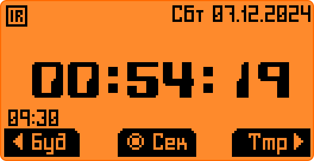
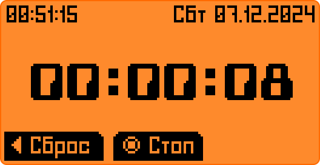
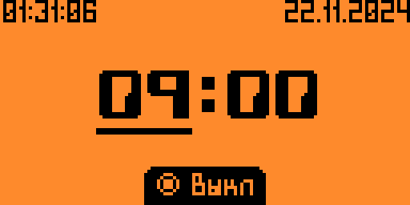

# AlarmaTik
Фапка-конвертер вашего хакиртула в часы с будильником.

-----
 
<h2 align="center">Часы</h2>
Чёткие, ровные часы. Ручная работа от кизлярских мастеров, создателей легендарных финок ЛГБТ.
  

- <ins><b>Компактиш:</b></ins> Нажми ВЗАД и скрой все эти подробности!

- <ins><b>Яркость:</b></ins> Вверх/Вниз - регулировка подсветки. Красный огонек чтобы видеть во тьме что дельфин еще дышит. А главное - она не гаснет. Лучшее украшение подоконника!
 

 
<h2 align="center">Таймер</h2>

Лучший помощник любого фаната соблюдения техпроцесса! И домохозяек. Просто, без излишеств, при выходе выходит тоже.
 

- <ins><b>Полосочка:</b></ins> Чтобы видеть издалека и прикидывать не глядя на циферки!

- <ins><b>БЗЗЗЗТ:</b></ins> Очень приятная свистоперделка заставит наслаждаться угасаниями экрана (не забудьте зачем вы его ставили)

   

<h2 align="center">Секундомер</h2>

Простейший счётчик от дядюшки Сяо. Считает долго, не разменивается на милисекунды. 

- <ins><b>Юзабилити:</b></ins> Можешь запускать его и останавливать, сбрасывать и повторять это снова и снова, вновь и вновь, всю жизнь напролет. Он не против. 

     

<h2 align="center">Будильник</h2>
АлармаТик - реликт от мастеров из Гномрегана, имеет систему синхронизации с системным БЗЗЗЗТ генератором.  

- <ins><b>Хитрый:</b></ins> В отличие от таймера не выходит вслед за вами, а переустанавлиает системный будильник если вкючен. Усыпляет своего системного брата во время работы и восстанавливает его состояние при выходе.

- <ins><b>БЗЗЗЗТ:</b></ins> Как у таймера!

- <ins><b>Добрый:</b></ins> Даст полежать еще 5 минут если тыкнуть в центр кругляша!

 
<h2 align="center">Ну просто кайф!</h2>

  - ангельский язык для партнеров

  - русланд язык для славян

  - переключалка пакетов рун

  - запоминалка настроек

  - настрайваемый БЗЗЗТ-генератор для будильника и таймера индивидуально

  - глушилка БЗЗЗТ любым модулированным ИК-сигналом 

  - настройка совместной работы встроенного и системного будильника 

  - два контакта (C3+ и B2-) для ваших железок при сработке таймера и будильника!

 
API от 78.1 
Cобирается и тестируется под Momentum
