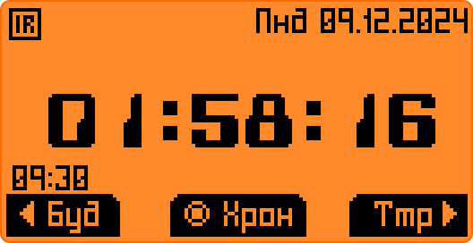
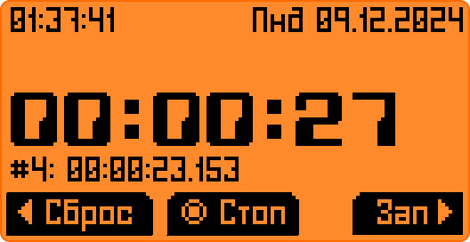
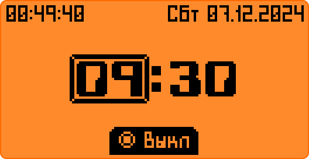

# AlarmaTik
Фапка, превращающая ваш хакиртул в будильник.

-----
 
<h2 align="center">Часы:</h2>
Чёткие, ровные часы. Ручная работа от кизлярских мастеров, создателей легендарных финок ЛГБТ.

- <ins><b>Компактиш:</b></ins> Зажми ОК и скрой все эти подробности!

- <ins><b>Яркость:</b></ins> Вверх/Вниз - регулировка подсветки. Красный огонек чтобы видеть в потьме что дельфин еще дышит. А главное - она не гаснет. Лучшее украшение подоконника!

 

-----
 
<h2 align="center">Таймер:</h2>

Лучший помощник любого фаната соблюдения техпроцесса! И домохозяек. Просто, без излишеств, при выходе выходит тоже.

- <ins><b>Полосочка:</b></ins> Чтобы видеть издалека и прикидывать не глядя на циферки!

- <ins><b>БЗЗЗЗ:</b></ins> Очень приятная свистоперделка заставит наслаждаться угасаниями экрана (не забудьте зачем вы его ставили)

 

-----
 
<h2 align="center">Секундомер:</h2>

Простейший тиктакер от дядюшки Сяо. Считает долго, не разменивается на милисекунды.

- <ins><b>Юзабилити:</b></ins> Можешь запускать его и останавливать, сбрасывать и повторять это снова и снова, вновь и вновь, всю жизнь напролет. Он не против. (99 часов ты все равно не выдержишь)

 

-----
 
<h2 align="center">Будильник:</h2>
АлармаТик - реликт от мастеров из Гномрегана, имеет систему синхронизации с системным БЗЗЗЗТ генератором.  

- <ins><b>Хитрый:</b></ins> В отличие от таймера не выходит вслед за вами, а переустанавлиает системный будильник если вкючен. Усыпляет своего системного брата во время работы и восстанавливает его состояние при выходе.

- <ins><b>БЗЗЗЗ:</b></ins> Как у таймера!

- <ins><b>Добрый:</b></ins> Даст полежать еще 5 минут если тыкнуть в центр кругляша!

-----
 
<h2 align="center">Ну просто кайф!:</h2>
Жесткий русланд-язык как на приборах, квадратные знаки как чёткие руны, запоминает ваши хотелки  

P.S. В шрифте нет укр символов. Ну таки дела, ребяты.

API v78.1 
Проверено на Momentum.
